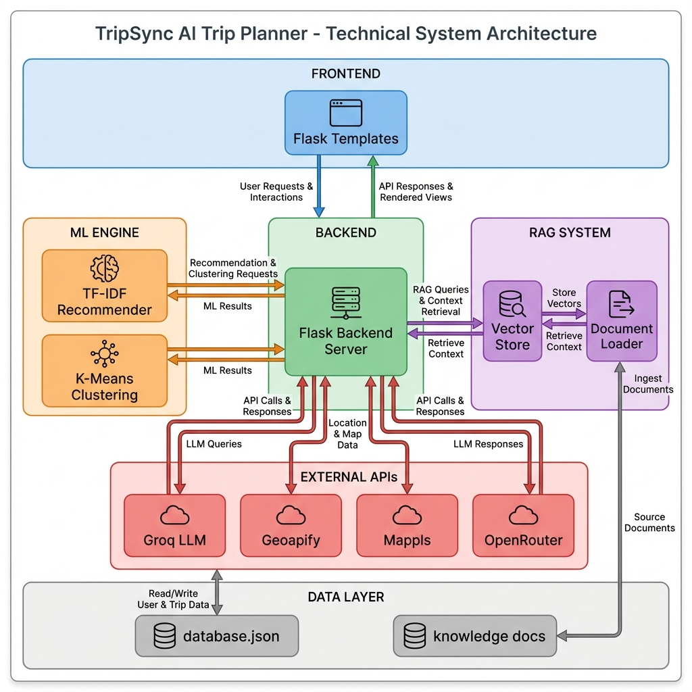
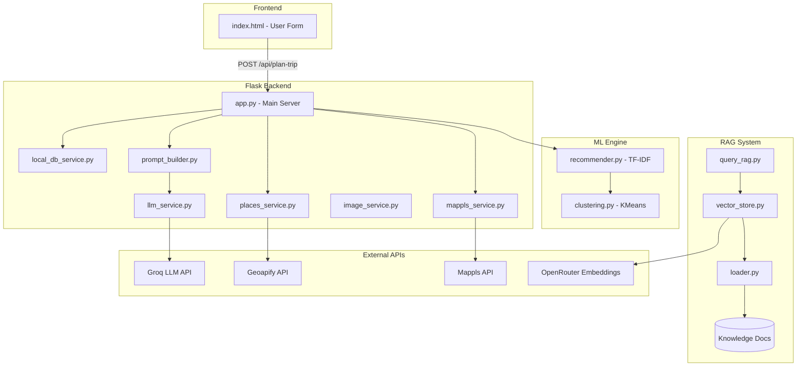
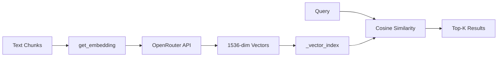
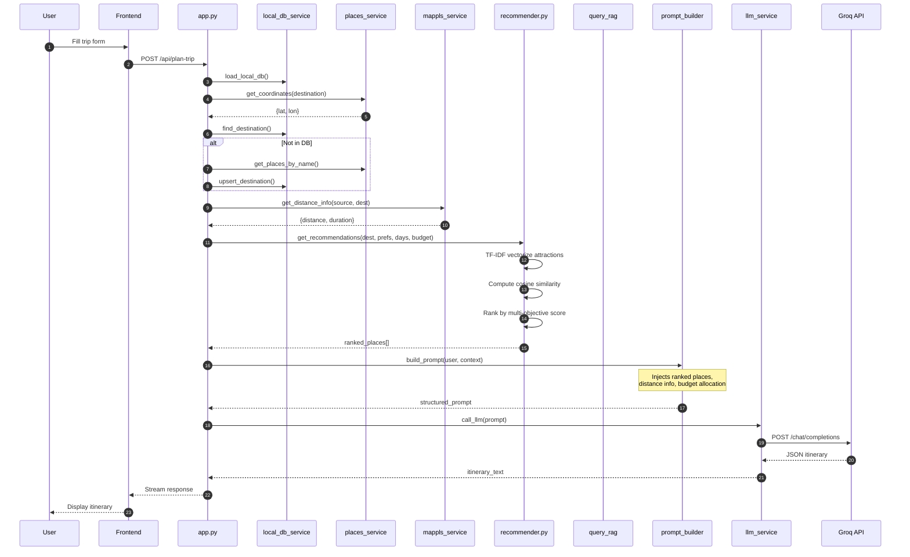

# TripSync AI Trip Planner - End-to-End Flow

## System Architecture Overview





---

## 1. User Input (Frontend)

**File:** [index.html](file:///Users/niks/Desktop/Trip-Planner/templates/index.html)

The user provides:
- **Source** (starting city)
- **Destination** (target city)
- **Budget** (total ₹ amount)
- **People** (number of travelers)
- **Days** (trip duration)
- **Transport Mode** (flight/train/bus/car/bike)
- **Preferences** (spiritual, adventure, nature, history, beach, romantic, shopping, nightlife)

---

## 2. Backend Processing Flow

**File:** [app.py](file:///Users/niks/Desktop/Trip-Planner/app.py)

### Step-by-Step Execution:

| Step | Component | Description |
|------|-----------|-------------|
| 1 | `local_db_service` | Load local database (`database.json`) |
| 2 | `places_service` | Get coordinates for destination via Geoapify API |
| 3 | Local DB Check | Find destination in local DB or fetch from API |
| 4 | `mappls_service` | Get distance/route info between source & destination |
| 5 | **ML Recommender** | Rank attractions using TF-IDF + preferences |
| 6 | `prompt_builder` | Construct detailed LLM prompt with context |
| 7 | `llm_service` | Call Groq API (Llama 3.3-70B) for itinerary generation |

---

## 3. ML Engine Components

### 3.1 Content Recommender (TF-IDF)

**File:** [recommender.py](file:///Users/niks/Desktop/Trip-Planner/ml_engine/recommender.py)

```python
class ContentRecommender:
    # Uses TF-IDF Vectorizer for text-based similarity
    tfidf = TfidfVectorizer(stop_words='english')
```

**Algorithm:**
1. **Feature Extraction**: Combines `category`, `spot_name`, `description` into text content
2. **TF-IDF Vectorization**: Creates sparse matrix of term frequencies
3. **Cosine Similarity**: Computes relevance between user preferences and places
4. **Multi-Objective Scoring**:
   - Preference Score (60%) - TF-IDF similarity
   - Distance Score (20%) - Gaussian decay based on haversine distance
   - Budget Score (20%) - Heuristic matching

### 3.2 Geographic Clustering (K-Means)

**File:** [clustering.py](file:///Users/niks/Desktop/Trip-Planner/ml_engine/clustering.py)

```python
class PlaceClustering:
    # Groups places by lat/lon for day-wise allocation
    kmeans = KMeans(n_clusters=5)
    scaler = StandardScaler()
```

**Purpose:** Groups nearby attractions to minimize travel time within each day.

---

## 4. RAG (Retrieval-Augmented Generation) System

> [!NOTE]
> The RAG system reduces LLM hallucinations by grounding responses in domain-specific knowledge. **RAG is now active in the main flow.**

### 4.1 Document Loading

**File:** [loader.py](file:///Users/niks/Desktop/Trip-Planner/services/rag/loader.py)

Loads `.txt` files from `knowledge_docs/`:
- [safety.txt](file:///Users/niks/Desktop/Trip-Planner/services/rag/knowledge_docs/safety.txt) - Safety tips
- [seasons.txt](file:///Users/niks/Desktop/Trip-Planner/services/rag/knowledge_docs/seasons.txt) - Best travel seasons
- [temple_rules.txt](file:///Users/niks/Desktop/Trip-Planner/services/rag/knowledge_docs/temple_rules.txt) - Temple etiquette

### 4.2 Vector Store & Embeddings

**File:** [vector_store.py](file:///Users/niks/Desktop/Trip-Planner/services/rag/vector_store.py)

| Component | Technology |
|-----------|------------|
| Embedding Model | `openai/text-embedding-3-small` (via OpenRouter) |
| Similarity Metric | Cosine Similarity |
| Vector Dimension | 1536 |



### 4.3 Query Interface

**File:** [query_rag.py](file:///Users/niks/Desktop/Trip-Planner/services/rag/query_rag.py)

```python
async def query_rag_async(query: str) -> str:
    store = get_vector_store()
    results = await store.similarity_search(query, k=3)
    # Returns formatted snippets with source metadata
```

### 4.4 Alternative FAISS Implementation

**File:** [build_index.py](file:///Users/niks/Desktop/Trip-Planner/vector_store/build_index.py)

Uses `sentence-transformers` (`all-MiniLM-L6-v2`) with FAISS for local vector search:
- Generates 384-dim embeddings
- Creates `IndexFlatL2` for exact L2 search
- Saves index to `faiss_index/places.index`

---

## 5. Prompt Engineering

**File:** [prompt_builder.py](file:///Users/niks/Desktop/Trip-Planner/services/prompt_builder.py)

### Prompt Components:
1. **System Instructions**: Role as expert Travel Planner
2. **Trip Details**: User inputs (destination, budget, days, etc.)
3. **Key Requirements**: Strict JSON output, real place names
4. **Context Injection**:
   - Distance info from Mappls API
   - RAG context (safety tips, seasonal info)
   - ML-ranked places list
5. **Budget Distribution**: Auto-calculated allocation percentages
6. **JSON Schema**: Strict output format for frontend parsing

---

## 6. LLM Service

**File:** [llm_service.py](file:///Users/niks/Desktop/Trip-Planner/services/llm_service.py)

| Configuration | Value |
|---------------|-------|
| API | Groq Cloud |
| Model | `llama-3.3-70b-versatile` |
| Temperature | 0.7 |
| Max Tokens | 6000 |

**Fallback:** Generates template-based JSON itinerary if API fails.

---

## 7. Data Layer

### Raw Data Sources

| File | Content |
|------|---------|
| `places.txt` | Destination descriptions |
| `spots.txt` | Tourist attractions |
| `food_options.txt` | Restaurant data |
| `stay_options.txt` | Hotel information |
| `travel_options.txt` | Transport routes |

### Processed Database

**File:** [database.json](file:///Users/niks/Desktop/Trip-Planner/data/processed/database.json) (5 MB)

Structure:
```json
[
  {
    "place_name": "Mahabaleshwar",
    "coords": { "lat": 17.92, "lon": 73.65 },
    "attractions": [
      { "spot_name": "Venna Lake", "description": "..." }
    ]
  }
]
```

---

## 8. External API Integrations

| Service | API | Purpose | File |
|---------|-----|---------|------|
| Geoapify | Places API | Geocoding, POI search | [places_service.py](file:///Users/niks/Desktop/Trip-Planner/services/places_service.py) |
| Mappls | Routing API | Distance calculation, route polylines | [mappls_service.py](file:///Users/niks/Desktop/Trip-Planner/services/mappls_service.py) |
| Groq | LLM API | Itinerary generation | [llm_service.py](file:///Users/niks/Desktop/Trip-Planner/services/llm_service.py) |
| OpenRouter | Embeddings | RAG vector embeddings | [vector_store.py](file:///Users/niks/Desktop/Trip-Planner/services/rag/vector_store.py) |

---

## 9. Complete Request Flow Diagram



---

## Summary Table: ML & RAG Files

| Category | File | Key Technology |
|----------|------|----------------|
| **ML** | [recommender.py](file:///Users/niks/Desktop/Trip-Planner/ml_engine/recommender.py) | TF-IDF, Cosine Similarity |
| **ML** | [clustering.py](file:///Users/niks/Desktop/Trip-Planner/ml_engine/clustering.py) | K-Means, StandardScaler |
| **ML** | [train_models.py](file:///Users/niks/Desktop/Trip-Planner/ml_engine/train_models.py) | Model training script |
| **RAG** | [loader.py](file:///Users/niks/Desktop/Trip-Planner/services/rag/loader.py) | Document chunking |
| **RAG** | [vector_store.py](file:///Users/niks/Desktop/Trip-Planner/services/rag/vector_store.py) | OpenRouter Embeddings |
| **RAG** | [query_rag.py](file:///Users/niks/Desktop/Trip-Planner/services/rag/query_rag.py) | Similarity search |
| **RAG** | [build_index.py](file:///Users/niks/Desktop/Trip-Planner/vector_store/build_index.py) | FAISS Index Builder |
| **RAG** | [embeddings.py](file:///Users/niks/Desktop/Trip-Planner/vector_store/embeddings.py) | SentenceTransformers |
